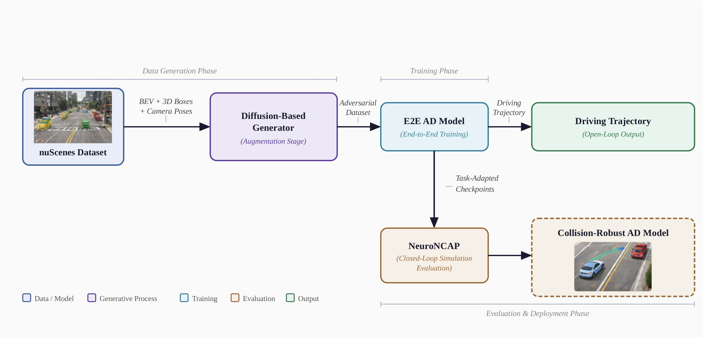
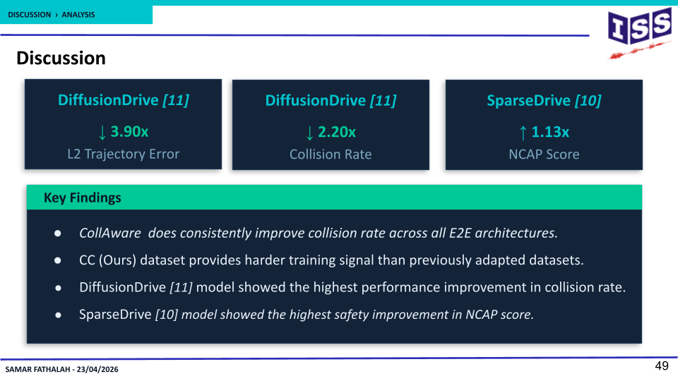
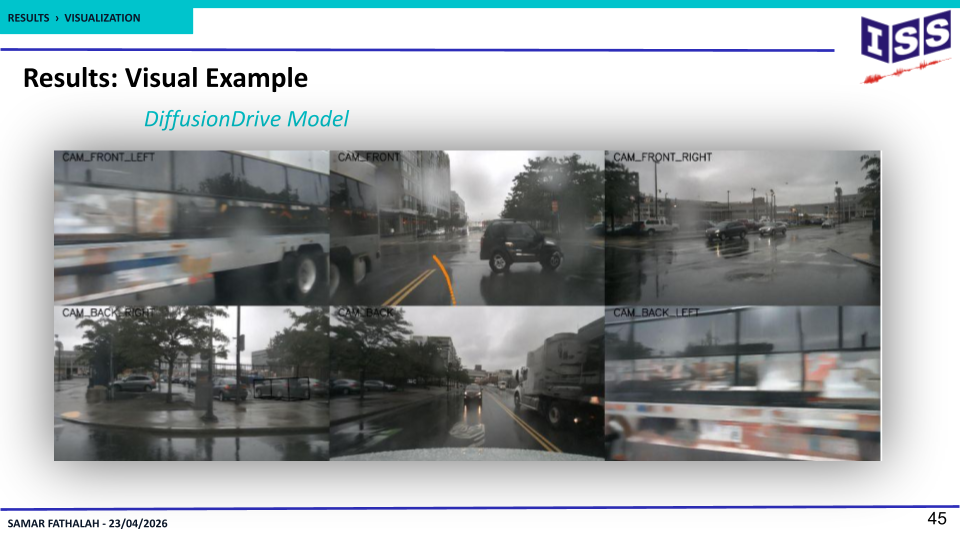

# Enhancing End-to-End Autonomous Driving in Safety-Critical Scenarios
Master's Thesis · University of Stuttgart · 2026

## Problem
End-to-end autonomous driving models fail in rare collision scenarios —
precisely the cases where real-world training data barely exists.

## Approach
Diffusion-based data augmentation pipeline that synthesizes collision and
near-collision scenarios from nuScenes by injecting adversarial vehicles,
then fine-tunes planning-oriented end-to-end driving models on the
augmented dataset.

## Results
**39% reduction in collision rate**, evaluated across both open-loop and
closed-loop frameworks.

.png)
.png)

## Stack
Python · PyTorch · Diffusion Models · nuScenes

📄 [Slides](slides/presentation.pdf)
